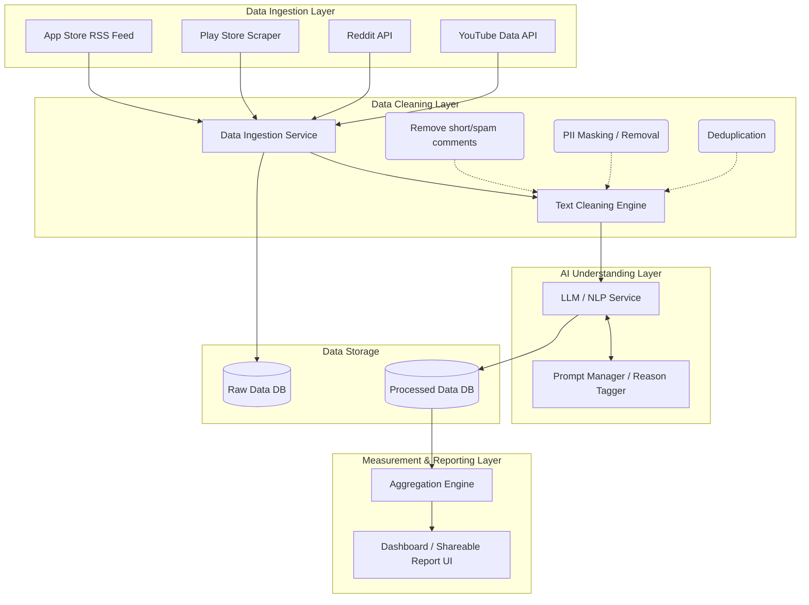

# System Architecture: Myntra Wishlist Hesitation Analysis

This document outlines the high-level architecture for the AI system designed to analyze and categorize user hesitation regarding Myntra wishlist items.

## 1. High-Level Architecture Diagram

## 2. Component Breakdown

### 2.1. Data Ingestion Layer (Collect)
Responsible for fetching public comments across various platforms on a scheduled basis (e.g., daily).
*   **App Store Collector**: Fetches reviews via Apple's public RSS feed without requiring authentication.
*   **Play Store Collector**: Uses a scraping library (like `google-play-scraper`) to extract reviews from the public Play Store listing.
*   **Reddit Collector**: Utilizes the Reddit API (e.g., via PRAW in Python) to query specific fashion subreddits or keyword-based searches.
*   **YouTube Collector**: Integrates with the YouTube Data API to pull comments from targeted fashion haul or review videos.

### 2.2. Data Cleaning Layer (Clean)
Before analysis, raw text is passed through a pre-processing pipeline to ensure data quality and privacy.
*   **Spam & Length Filter**: Drops comments with less than 8 words, or those consisting entirely of emojis.
*   **PII Masking**: Uses regular expressions and Named Entity Recognition (NER) to redact usernames, emails, and phone numbers.
*   **Deduplication**: Identifies and removes duplicate or highly similar comments to avoid skewed analysis.

### 2.3. AI Understanding Layer (Understand)
The core analytical component that applies reasoning to the cleaned text.
*   **LLM Service**: An AI model (such as OpenAI's GPT-4, Google's Gemini, or a specialized Hugging Face model) reads the comments.
*   **Reason Tagger**: A component that constructs the prompt with the predefined categories (Size/Fit, Price, Styling, Occasion, Comparing, Window Shopping) and maps the model's output to these structured tags.
*   **Quote Extractor**: Ensures the exact relevant substring of the comment is stored alongside the tag for proof and context.

### 2.4. Data Storage Layer
Stores both raw and processed data for auditing, retraining, and reporting purposes.
*   **Raw Data DB**: A database (e.g., PostgreSQL or MongoDB) storing the unmodified text as it was collected.
*   **Processed Data DB**: Stores the cleaned text, the AI-generated tags, and the extracted quotes.

### 2.5. Measurement & Reporting Layer (Measure)
Aggregates the categorized data into a user-friendly format.
*   **Aggregation Engine**: Calculates the percentage distribution of each hesitation reason (e.g., 38% Size/Fit, 24% Price).
*   **Dashboard / Report UI**: A web interface (e.g., Streamlit, Next.js, or a BI tool like Metabase) that presents the ranked list of reasons and their corresponding real user quotes in a clear, digestible format (consumable in 5 minutes).
